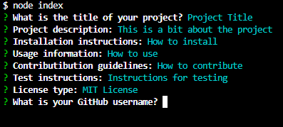

# Readme Generator

# Description

This project allows you to generate a readme through prompts in your terminal

# Table of Contents

- [Description](#Description)

- [Installation](#Installation)

- [Usage Information](#Usage-Information)

- [Contribution guidelines](#Contribution-guidelines)

- [Examples](#Examples)

- [License](#License)

# Installation

To install, clone the repository, and make sure to install all related dependancies

# Usage Information

To use, simply open the folder in an integrated terminal, and run 'node index'

# Contribution guidelines

Contributions are all welcome

# Examples

# License
    
- [MIT] https://www.mit.edu/~amini/LICENSE.md

# Questions?

- GitHub: jarenella

- Email: jamesa122333@gmail.com

